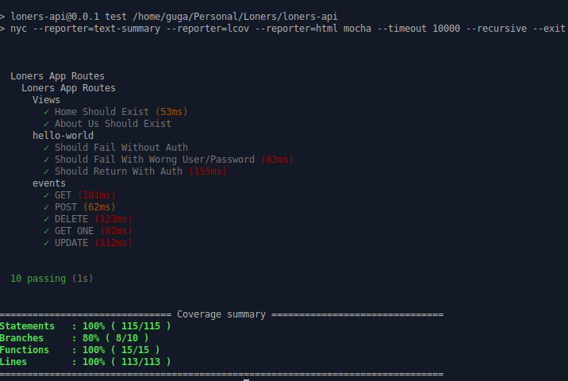
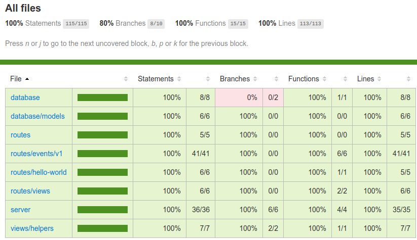

# Loners App API

Database and API endpoinds for the Loners App. 

This API should handle all the requests using NodeJS, Hapi and MongoDB.

## Technologies Used

NodeJS, Hapi, Swagger, MongoDB, Mongoose, Mongo-Express and Docker.

## How To Install

* clone the project with 
```
git clone https://github.com/gugazimmermann/loners-api.git
```
* go to the project folder 
```
cd loners-api
```
* make sure you have installed **docker** and **docker-compose**

## How To Run

#### LINUX

#### First Time

```
./start.sh
```

Follow the instructions, this will create the users inside the database.

To close, just type: `Ctrl+C`

#### After database created

You can just run:

```
docker-compose start -d
```

and to stop:

```
docker-compose stop
```

## How To Use

API Endpoint: http://localhost:8080

MONGO EXPRESS: http://localhost:8081 - use the same username and password.

## API ENDPOINTS

See API Documentation: http://localhost:8080/documentation

## How to Test

Make sure that you are running the database (see **How To Run**), we recommend that you stop the API container before running the tests:

```
docker stop loners-hapi-api
```

Run:

```
npm test
```

and wait, the result must be:



Open `coverage/index.html` to see the report.

